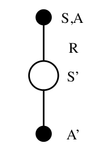

```{r setup, include=FALSE}
knitr::opts_chunk$set(echo = TRUE)
```

* Intro to RL
* MDP
* planning by dynamic programming
* model-free prediction
* model-free control
* value function approximation
* policy gradient methods
* integrating learning and planning
* exploration and exploitation
* classic games

# Intro to RL (definitions)


A **policy** is a distribution over actions given states, which defines the behavior of an agent. Policies are stationary, meaning, they don't change over time.

The **state-value function** $v_\pi(s)$ of an MDP is the expected return starting from state s, and then following policy $\pi$.

$$ v_\pi = \mathbb{E}[G_t | S_t = s] $$
The **action-value function** $q_\pi (s, a)$ is the expected return starting from state s, taking action a, and then following policy $\pi$.

The **return** is the total discounted rewards:
$$ G_t = R_{t+1} + \lambda R_{t+2} +...+ \lambda^{T-1} R_{T}$$
$P$ is a **state transition probability** matrix,
$$P_{ss'} = P [S_{t+1} = s' | S_t = s]$$

The **Bellman Expectation equation** can be expressed concisely using matrices,
$$v = R + \gamma Pv$$
and has a close form solution. $R$ is immediate reward, and $P$ is the state transition matrix. The **discount** $\gamma \in [0, 1]$ is the present value of future rewards.

* Question: What is the relation between Bellman Optimality equation and Bellman Expectation Equation?

Bellman Optimality equation is:
$$v_{\pi}(s)  =\underset{a \in A}{ \mathrm {max} } q_\pi (s, a)$$

Why Bellman Optimality equation is non-linear? Because of max terms. There is no close form solution for this equation. But, there are some iterative ones, namingly; Value Iteratiion, Policy Iteration, Sarsa and Q-Learning.

# MDP

A **Markov Reward Process** is a tuple $<S, P, R, \gamma>$, and if we add actions ($A$) to the tuple, we will get a **Markov Decision Process**.

The **return** $G_t$ is the total discounted reward from time-step t. The return is consist of the **immediate** reward and the reward **over the rest of the trajectory**.

A **belief state** $b(h)$ is a probability distribution over states,
conditioned on the history h
$$b(h) = (P[S_t = s_1 | H_t = h , ..., P [S_t = s_n | H_t = h])$$
A history $H_t$ is a sequence of actions, observations and rewards,
$$ H_t = A_0 , O_1 , R_1,..., A_{t-1} , O_t , R_t $$
The belief state $b(H_t)$ and history $H_t$ satisfy the Markov property.

For **POMDP**s we cannot see the whole states directly. Instead, we have observations of the environment, in which the states can be inferred from. 
$Z$ is observation function, tells how the states and $O$ are related
$$Z_{s^\prime o}^a = P [O_{t+1} = o | S_{t+1} = s' , A_t = a]$$
Where $O$ is a finite set of observations.

A **POMDP** is a tuple $<S, A, O, P, R, Z,\gamma>$

A POMDP can be reduced to a history tree or a belief state tree.

# Planning by dynamic programming

Dynamic Programming: When we have a sequential component to a problem, in which we want to optimize, we are dealing with **Dynamic Programming**.

The reason why we can use dynamic programming to solve a MDP is that MDPs satisfy both required properties for having a problem solved by a dynamic programming based solution. Solutions can be I) decomposed (to solve subproblems) and II) can be cached and reused (to be combined as the final solution). Bellman equation gives us the ability to do recursive decomposition. Value function can be stored and reused.


DP assumes full knowledge of the MDP. In **Planning**, it's used for prediction (evaluation of a given policy, when the output is just the value function), or control (figuring out the optimal policy, the output is a policy).

* Question: In principle of optimality, we say if we can take the best action in current state, and then take the optimal action from that stage onward, we can say the whole procedure was optimal. Is it a feature for the system? Because surely we know that this is not true for every system. Yes, if you know that you can 

## Policy Iteration
We want to evaluate a given policy $\pi$. **Policy iteration** approach calculates $v_\pi(s)$ by one step look ahead into the Bellman Expectation equation (Policy Evaluation), and then acting greedily with respect to the value function (Policy Improvement) in order to find the optimum solution.

## Value Iteration
If we know the solution to subproblems $v_*(s')$, then solution for $v_*(s)$ can be found by one-step lookahead.
$$ v_*(s) = \underset{a \in A}{\mathrm {max} } {(R_s^a + \sum_{s' \in S} {\gamma P_{ss'}^a v^*(s')} } $$
    
* What's the difference between value iteration and policy iteration?

    + In **value iteration**, unlike policy iteration, we don't build a policy at each step. At the end, however, we know that we found a value function which is associated with the optimal policy.  In policy iteration, the value function is the value function for a particular policy in each intermediate step. 
    + The intuition behind value iteration is starting with the final reward and working backwards.


* Q: How do we know that both policy interation and value iteration converge to the optimum solution? This can be proved using the contraction mapping theorem.

# Model-free prediction

What if we don't have the MDP that governs the problem, and we still want to solve the problem? We need to come up with a way to solve a problem, without any prior knowledge of the problem's MDP. Model-free methods can estimate the value function of an unknown MDP.

* Question: why do we write the bellman expectation equation for both state value function and the action value function?
Because we need it later on, when we develope **model-free** algorithm for control. To derive equations based on action value function, we don't need to have MDP or the model of the system. So, it makes the algorithm model free.


The complexity for having the prediction and control based on action value function is more than having them solved by state value function ($O(n^2m^2) vs. O(n^3m^3)$). But, we are going to use them anyways, because, they will help us avoid doing one step look ahead, hence, we can solve a full reinforcement learning problem withou any model. Meaning that we don't have to know the dynamics of the system necessarily. 

Dynamic programming considers full-width back-ups, meaning it considers all possible state that the system might be taken into in every single step. In addition, we need to know the dynamics of system to do the look ahead. These are two important drawbacks in DP.

1. In large problems, it is very costly. Instead, we can do **sampling** to solve an RL problem. This breaks the curse of dimensionality.

2. We have to know the dynamics of the system. Using sampling, we also don't need to know the model of the environment. 

So, we use samples of R and P instead of using the full function.
There are two major solutions for a model-free prediction problem, Monte-Carlo and Temporal-Difference learning.


## Monte-Carlo Learning
The goal in MC is to learn $v_\pi$ from episodes of experiences under policy $\pi$.
Monte-Carlo policy evaluation uses **empirical** mean return instead of expected return. In MC, we replace the empirical learning with the expectation function. We do that by sampling over the trajectory from the state s on-wards. The only issue is that how we get back to the state we were to replicate the process in order to have a better sampling, and also we want to do that for all states. We generate the trajectory based on the policy, and sample from that trajectory. If we do this procedure enough times, we can make sure that the mean converges to the empirical mean. There is a problem in the RL, which is to make sure we have explored all states-actions, and at the same time, we need to find the optimal policy.

* Q: There are two Monte-Carlo policy evaluation methods: **First visit, every visit**. What are they for? How do they work?

First-visit MC policy evaluation: We only care about the first time we visit a state in various episodes of the experiment.

There is also another MC method, called incremental MC. It uses the incremental mean. In this method, sometimes the term N (number of the random variable) is being replaced by $\alpha$, which gives a forgetting nature to the equation. Sometimes we want to forget the things that came a long time ago. By replacing 1/N with an $\alpha$ factor, we give a forgetting factor to the mean calculation of the return.

Incremental Monte-Carlo updates: we calculate the difference between the estimate of the current return (which is the mean of the value function until the last step) and the real current return, and we update the mean of the return in the direction of the previous step.
$$ V(S_t) <- V(S_t) + (G_t - V(S_t))$$

It samples one complete trajectory to the end, and use those samples to estimate the return value.


## Temporal Difference learning
Temporal-Difference learning just does one step lookahead and estimate the return after one step.

In **bootstrapping**, we substitute the real return for the remainder of a trajectory with our estimate of the return for the trajectory in order to do iterative update. So, MC doesn't bootstrap. But, TD and DP does bootstrap. They use a guess of how much value we are going to get going the rest of the trajectory.

In TD(0) leaning, we update the return with our estimated return, instead of the real return. The estimated return is consist of the **immediate** reward and the estimated reward **over the rest of the trajectory**. → TD target.
$$ V(S_t) \leftarrow V(S_t) + \alpha (R_{t+1}+ \gamma V(S_{t+1}) - V(S_t))$$

**TD error**, the difference between our estimate before and after taking step.

In MC, we have to wait until the final result comes out, so that we can calculate (update) each return error at previous steps. Whereas, in TD, we do the update in every step. In TD($\lambda$), we do update every $\lambda$ steps.

In cases we will never see the final return, we **have to** use TD. 

In **forward-view $TD(\lambda)$** we look into the future and only update the value function towards the $\lambda$-return, and can only be computed from complete episodes. However, in **backward-view** we update each state in proportion to the TD-error and the eligibility trace. So, we need to keep track of eligibility trace for every state s.
$$ \delta (s) = R_{t+1}+ \gamma V(S_{t+1}) - V(S_t) $$
$$ V(S_t) \leftarrow V(S_t) + \alpha \delta(s) E(s)$$

# MC vs. TD vs. Dynamic Programming
In DP, we don't sample, we look at the whole tree and back up the return values for each node by doing one step look ahead. In MC, we sample a complete path and back up for the intermediate nodes. But, the update is done at the end of the whole trajectory. In TD, we only consider a part of a complete path and sample for that.
So, for dp, because we take expectation, we have to know the transition probabilities, and do a complete back up to find the return in a parent node.


We can make more robust algorithms by taking the weighted average of the returns, instead of one particular return.

### Eligibility traces
Frequency heuristic: assign credit to most frequent states
Recency heuristic: assign credit to most recent states
Eligibility traces combine both heuristics

$$E_t(s)= \gamma \lambda E_{t-1}(s)+ 1(S_t=s)$$

# Model-Free Control
Now that we have solved the problem of estimating the value function for an unknown MDP, we can go further and optimise the value function for the unknown MDP. This is called **model-free control**. Model-free control is meant to solve MDPs that are unknown, but can be sampled, or known, but too big to use, except by samples.

There are two main methods to do model-free control; **on-policy & off-policy** learning. On-policy learning is when you learn a job by experiencing a policy $\pi$ and sampling from $\pi$. Off-policy learning is when you look over someone's shoulder and learn the policy $\pi$ from sampling the experience $\mu$.

## On-policy MC Control
It's not necessary to evaluate all of the actions in a policy evaluation step. We can do sampling, and after a sampling, we already have enough information to evaluate the policy and act greedy with respect to that policy. Therefore, we can repeat this process for each step, and not wait until exploring all possible actions.

## GLIE (Greedy in the limit with infinite information)
There is a problem in the RL, which is to make sure we have explored all states-actions, and at the same time, we need to find the optimal policy. There is theorem for GLIE property in p15 of control.pdf. If we act $\epsilon$-greedy and choose $\epsilon = \frac{1}{k}$, we fulfil the GLIE property.

The algorithm that has GLIE property and does MC control is called **GLIE MC Control**. It samples the policy $\pi$, updates the Q value for each state-action pair and improves the policy using $\epsilon$-greedy method based on the new action-value function.

In the same procedure, if we use TD instead of MC, we will have a solution with much lower variance, and in online. This method is called **SARSA**. The updating rule for the action-value function is
$$ Q(S, A) \leftarrow Q(S, A) + \alpha( R + \gamma Q(S' , A' )) - Q(S,A)$$

<div>
{width=20%}
</div>

Sarsa is an on-policy control algorithm, meaning it selects actions and evaluate it on the same policy.

Sarsa($\lambda$) is when we replace the q with $q^\lambda$. Lambda actually gives the ability to choose based on the require bias-variance trade-off. But, the problem is that it's not an online algorithm. You have to wait until the end of the episode. $\lambda$ determines how fast the information will propagate in sarsa($\lambda$). So, in sarsa(0), each grid is updated one episode at a time. But, this can be done in just one episode by using backward-view sarsa($\lambda$). And, that's because of the eligibility trace. 

## Off-policy learning advantages

Sometimes we want to learn from another agent, for instance human, to see how we can do better than that. Or, we followed different policies to the current point, but, we want to know what if we have followed the policies we employed later on in the process and generated the data we can see right now. This is where we need to consider off-policy learning.


## $\epsilon$-greedy exploration

All m actions are tried with non-zero probability.

